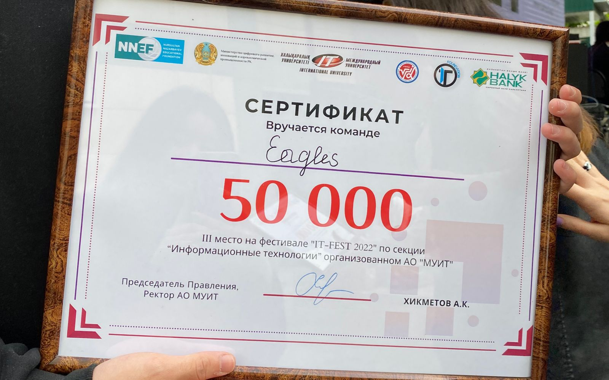
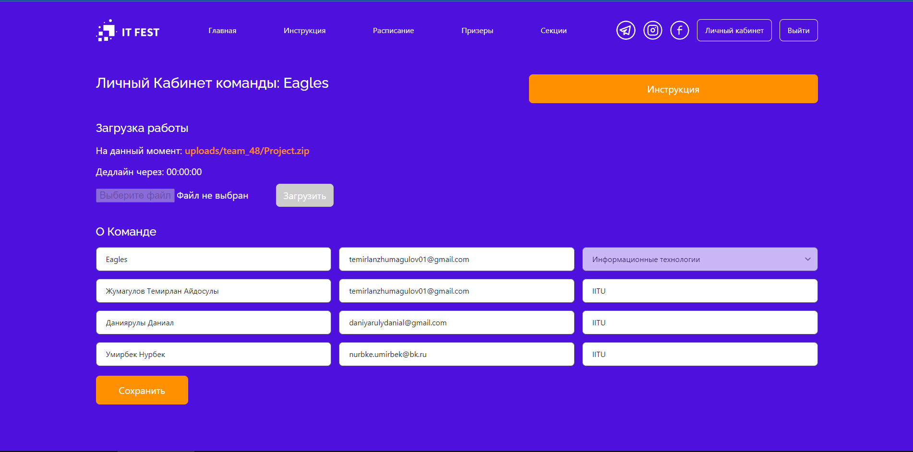

# IT FEST 2022
## What is IT Fest?
This is an opportunity to implement a project in a short time in a powerful creative environment, assemble a team or join an interesting project
### Date of the event
April 18-23
### Stages
1. Register the command (The team has a maximum of 3 people)
2. Come up with an idea
3. Develop a prototype
### Sections
Information technology, Cinema and Video, CyberSecurity, CyberSport, Design and animation, Ready-made solutions
## Certificate

## Project link
https://github.com/TemirlanZhumagulov/JavaLevelUp
